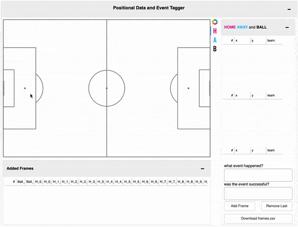

<H3> Tracking Data and Event Tagger </H3>

This is a small Panel App that allows you to make your own tracking data and download it.  



Simply choose the team or the ball icon on the right and click to create a player.  
You can click&hold to move them as long as the corresponding icon is active.  
Remove a playermarker by clicking and then pressing the Backspace key.  

You can clone this repository, install the requirements and run it with  
```
panel serve --show tracking_tagger.ipynb
```

